# 📊 FinTech Payment & Customer Analytics Platform

## 📌 Project Overview

This project is an end-to-end FinTech analytics platform built using **Python, MySQL, SQL, and Power BI**.

The solution was designed to simulate a real-world business intelligence workflow used in financial and payment analytics environments.

The project covers:

- data cleaning and preprocessing using Python
- dimensional data warehouse modeling
- star schema implementation
- SQL analytics and reporting
- Power BI dashboard development
- KPI reporting and business insight generation

The platform analyzes customer transactions, payment channels, regional performance, product categories, and customer behavior to support business decision-making.

---

# 🛠 Technologies Used

- Python
- Pandas
- MySQL
- SQLAlchemy
- Jupyter Notebook
- Power BI
- DAX
- Star Schema Data Modeling

---

# 📂 Project Workflow

Raw CSV Files → Python Data Processing → MySQL Data Warehouse → SQL Analytics → Power BI Dashboard Reporting

---

# 🗄 Data Warehouse Architecture

The project follows a dimensional modeling approach using a **star schema** architecture.

## Fact Table
- `fact_transactions`

## Dimension Tables
- `dim_customers`
- `dim_customers_usa`
- `dim_accounts`
- `dim_products`
- `dim_products_categories`
- `dim_products_subcategories`
- `DateTable`

Primary keys and foreign key relationships were implemented to improve:

- data integrity
- relationship consistency
- query performance
- Power BI relationship modeling

---

# 📊 Dashboard Features

The interactive Power BI dashboard includes:

- Total Transaction KPI Cards
- Transaction Value Analysis
- Average Transaction Metrics
- Regional Transaction Analysis
- Product Category Performance
- Payment Channel Analysis
- Interactive Slicers and Filters
- Yearly Transaction Trend Analysis
- Customer Transaction Analysis

---

# 🧠 Business Insights

The project generated several business insights, including:

- Identification of top-performing regions by transaction value
- Analysis of customer transaction behavior across regions
- Product category performance comparison
- Transaction channel performance analysis
- Year-over-year transaction trend analysis
- Executive-level KPI monitoring

---

# 📸 Dashboard Preview

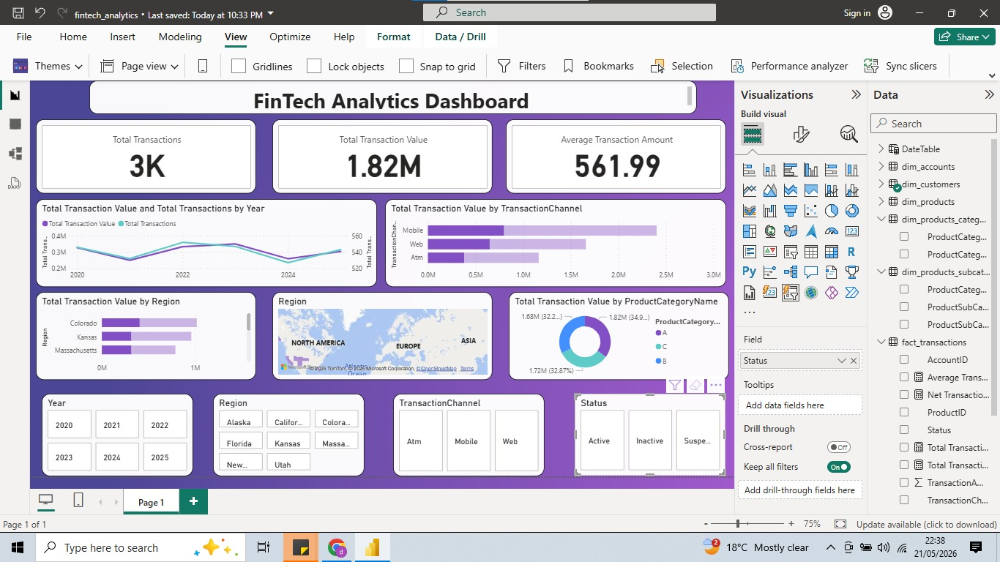

---

# 📸 Data Modeling Screenshots

## Star Schema Relationship Model
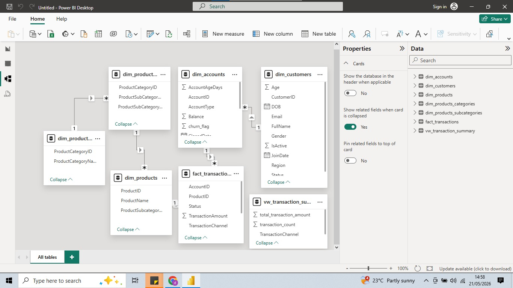

## Primary & Foreign Keys
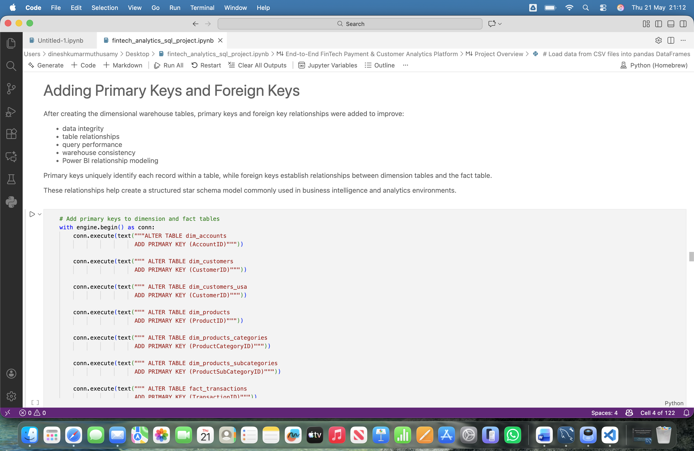

## Verify Foreign Keys
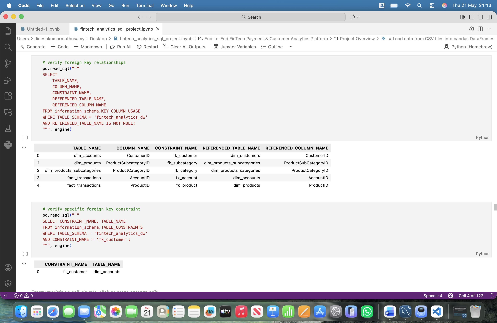

## Power BI Relationship Model
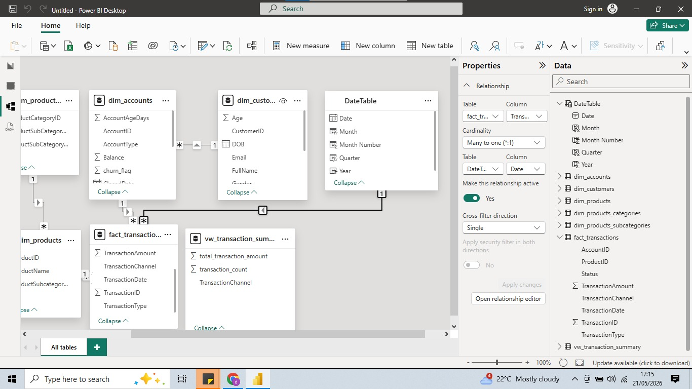

---

# 📸 Power BI & DAX Screenshots

## Date Table DAX Creation
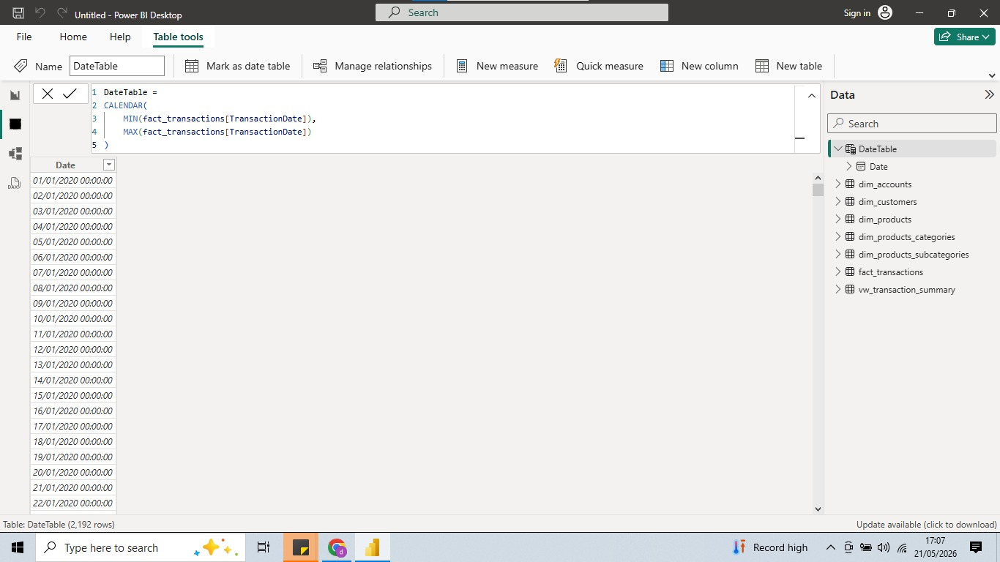

## Date Table Columns
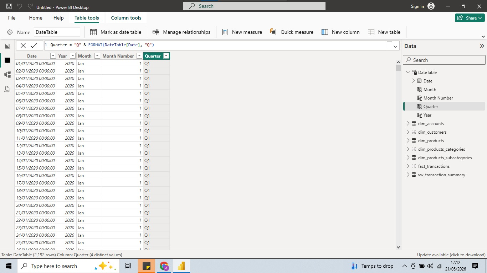

## MySQL to Power BI Import
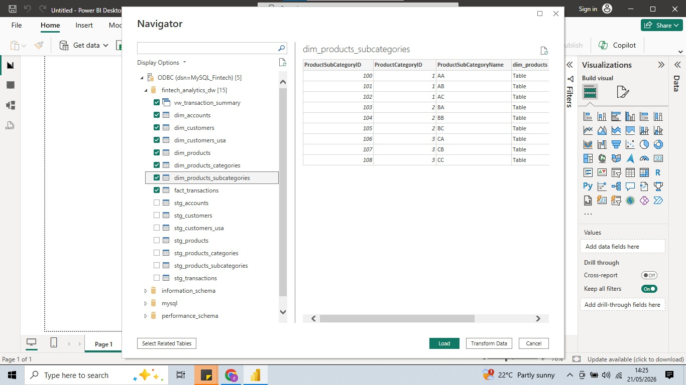

---

# 📸 SQL Analytics Screenshots

## Yearly Transaction Trend Analysis
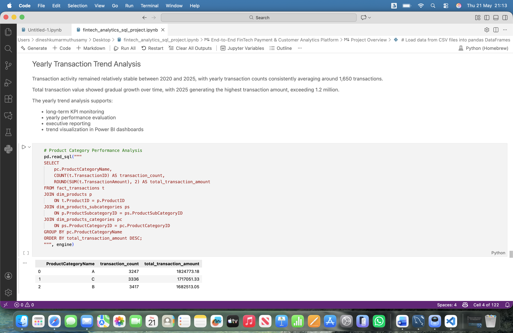

## Regional Transaction Analysis
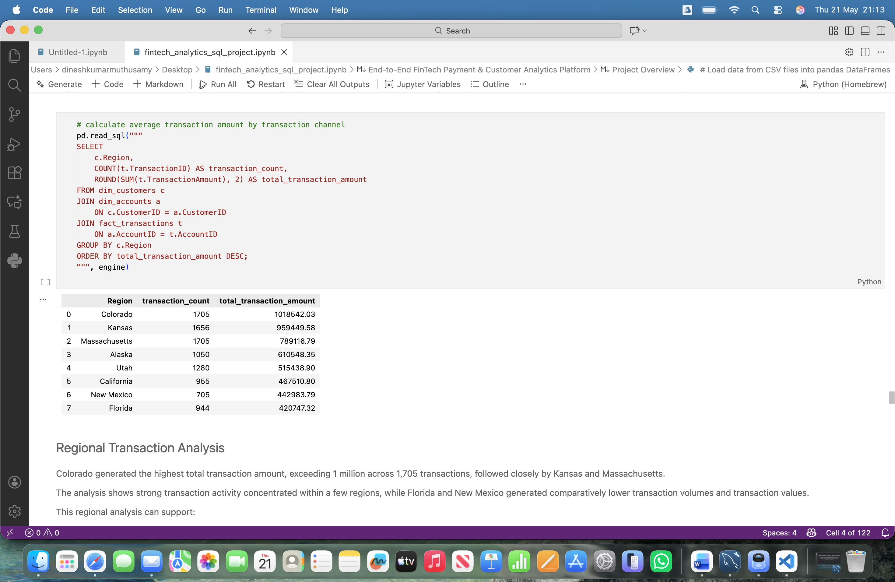

## Top Customers Analysis
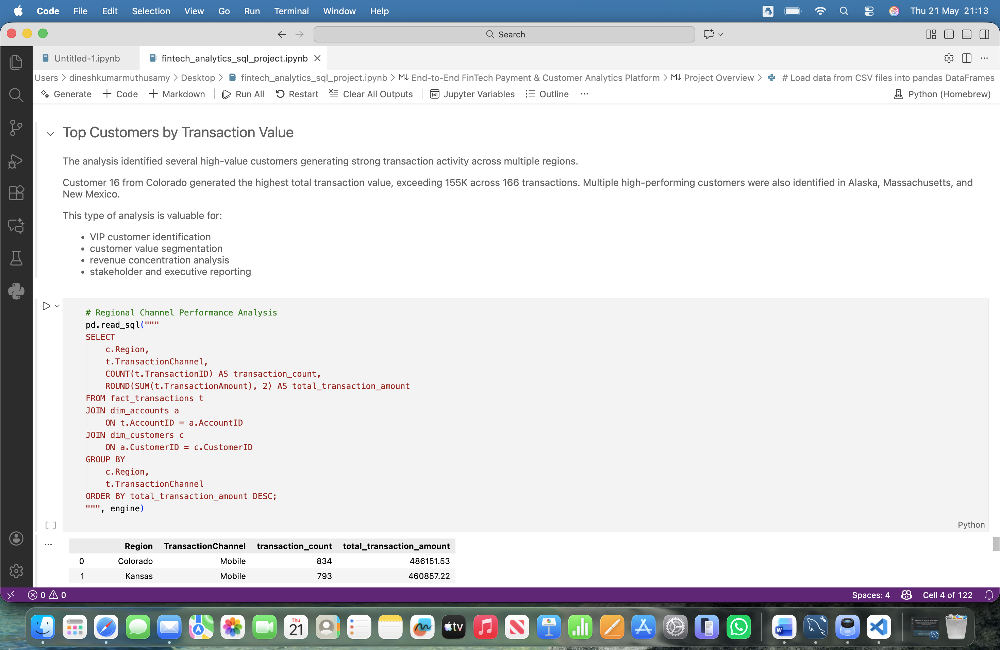

## Power BI Reporting View SQL
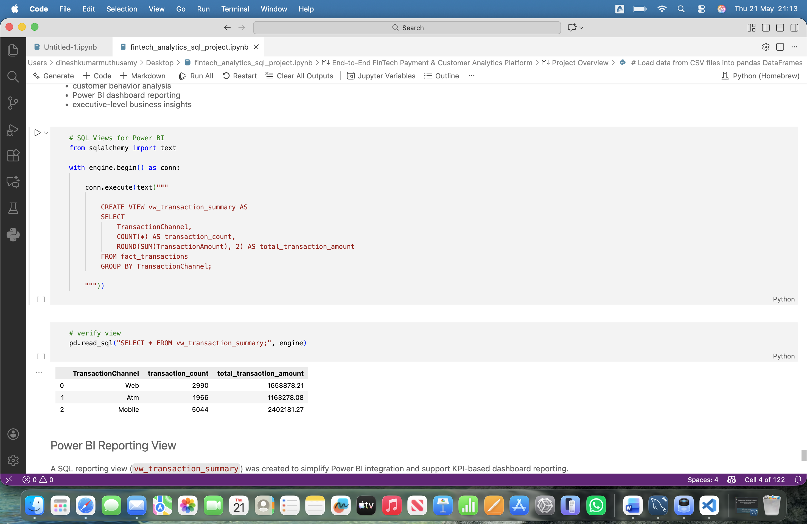

---

# 📂 Repository Structure

```bash
fintech-payment-customer-analytics-platform
│
├── data_raw
├── screenshots
│   ├── dashboard
│   ├── modeling
│   ├── powerbi
│   └── sql_analysis
│
├── demo-video
├── fintech_analytics.pbix
├── fintech_analytics_sql_project.ipynb
└── README.md
🚀 Key Learning Outcomes
Through this project, I strengthened my skills in:
dimensional data modeling
SQL analytics
Power BI dashboard development
DAX calculations
business KPI reporting
data warehouse design
ETL-style workflows
end-to-end analytics project development
📌 Future Improvements
Add customer churn prediction
Implement fraud detection analysis
Add advanced DAX time intelligence
Build forecasting models
Deploy dashboard to Power BI Service
👨‍💻 Author
Dinesh Kumar Muthusamy
Data Analyst | BI Analyst
SQL | Power BI | Python | MySQL
Business Intelligence & Analytics Projects
